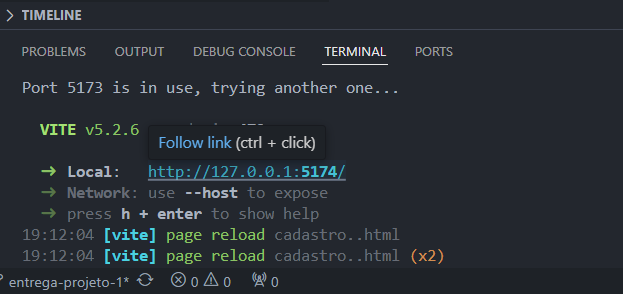

<h4 align="center"> 
	🚧  Lorem Supplements 🚀 Em construção...  🚧
</h4>
<h2>Caso você tenha baixado o projeto na sua maquina, terá que iniciar ele da seguinte forma.</h2>

Baixe o node.js na sua maquina para conseguir iniciar o npm.

Depois você irá abrir o projeto e instalar as dependencias.

## abra o terminal do VS Code.
$ npm install

## Execute a aplicação
$ npm run dev

## o projeto irá mostrar o link direto no terminal como o exemplo abaixo.

## Basta clicar no link que está ao lado do local.